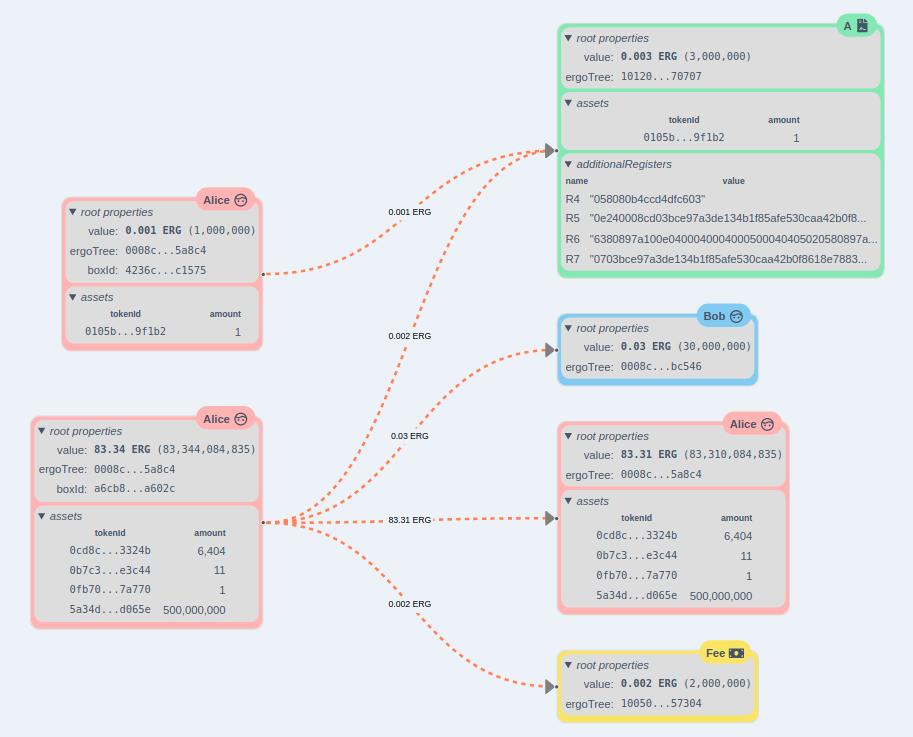

<!--suppress HtmlDeprecatedAttribute -->
<div align="center">

**ertravi** = Ergo Transactions Visuals

This is an <b>alpha</b> version!

[](https://github.com/RalfWeiss/ergo-transaction-visual/actions/workflows/tests.yml)

</div>

----

<!-- START doctoc generated TOC please keep comment here to allow auto update -->
<!-- DON'T EDIT THIS SECTION, INSTEAD RE-RUN doctoc TO UPDATE -->
**Table of content**

- [Features](#features)
- [Getting started](#getting-started)
- [Setup](#setup)

<!-- END doctoc generated TOC please keep comment here to allow auto update -->

----

## Features

> The main focus of this repo is making tools to help understand the **[Ergo](https://ergoplatform.org/)** blockchain. As a starting point you'll find the **txio-view-react** which tries to map inputs to outputs in a visual appealing way usable within a **React** app.

## Getting started

Run these commands from the projects root:

```
yarn
yarn build
cd examples/nextjs
yarn dev
```

This will start the Nextjs development server and you have some routes demo data to look at.

As of now, with version v0.0.31, you could see sth. like this:



This means:
- amount of transfered value is added to the edges
- deep combinatory analysis
  - spreads values over boxes until it finds a reasonable solution (least changes)
  - **drawbacks**: 
    - can take some time if the no of boxes rises
    - blocks UI while performing analysis
- configure `boxColors` and `rootPropsToShow`
- **Auto-Layout** could rearrange connected boxes
- ability to toggle between **Auto-Layout** and simple positioning
- related boxes (same value for `ergoTree`) share same color.
- ~~boxes with same boxId are connected by an arrow line~~
- ~~boxes which have same tokenId are connected by an arrow line~~

## Setup

This repo was initially cloned from [Template project for setting up a TypeScript monorepo](https://github.com/NiGhTTraX/ts-monorepo).

Some modifications were needed. More on this under [setup documentation](./docs/setup.md)