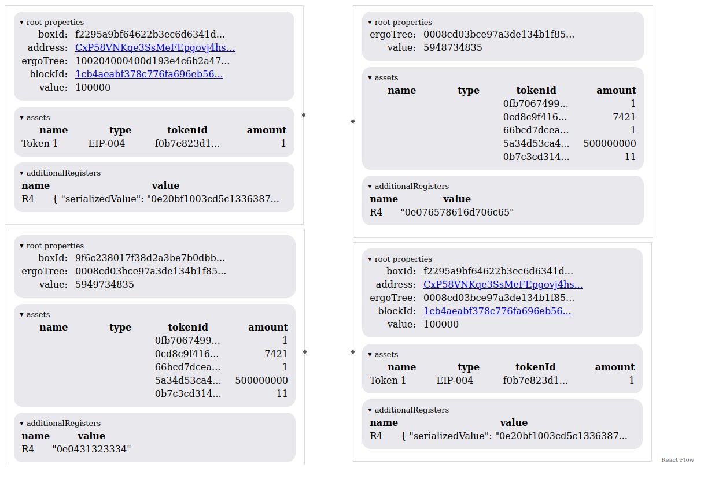

<!--suppress HtmlDeprecatedAttribute -->
<div align="center">

**ertravi** = Ergo Transactions Visuals

[](https://github.com/RalfWeiss/ergo-transaction-visual/actions/workflows/tests.yml)

</div>

----

<!-- START doctoc generated TOC please keep comment here to allow auto update -->
<!-- DON'T EDIT THIS SECTION, INSTEAD RE-RUN doctoc TO UPDATE -->
**Table of content**

- [Features](#features)
- [Getting started](#getting-started)
- [Setup](#setup)

<!-- END doctoc generated TOC please keep comment here to allow auto update -->

## Features

> The main focus of this repo is making tools to help understand the **Ergo** blockchain in. As a starting point you'll find the **txio-view-react** which tries to map inputs to outputs in a visual appealing way usable within a **React** app.

## Getting started

Run these command from the projects root:

```
yarn
yarn build
cd 
cd examples/nextjs/
yarn dev
```

This will start the Nextjs development server and you have some routes: [index](https:\\localhost:3000)

## Setup

This repo was initially cloned from [Template project for setting up a TypeScript monorepo](https://github.com/NiGhTTraX/ts-monorepo) and **/demo-2** to **/demo-4**.
As of now, with version v0.0.1, you should see sth. like this:
![..]


