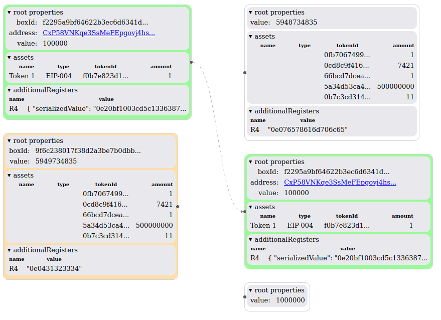

<!--suppress HtmlDeprecatedAttribute -->
<div align="center">

**ertravi** = Ergo Transactions Visuals

</div>

----

## Features

> The main focus of this repo is making tools to help understand the **[Ergo](https://ergoplatform.org/)** blockchain. As a starting point you'll find the **txio-view-react** which tries to map inputs to outputs in a visual appealing way usable within a **React** app.

As of now, with version v0.0.7, you could see sth. like this:



This means: 
- related boxes share the same color.
- boxes with same boxId are connected by an arrow line

## Getting started

To add it to your project run:

```
yarn add @ertravi/txio-view-react
```


